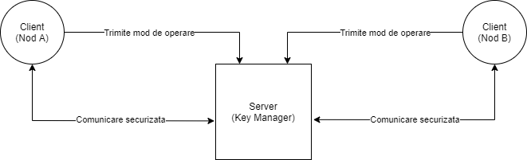
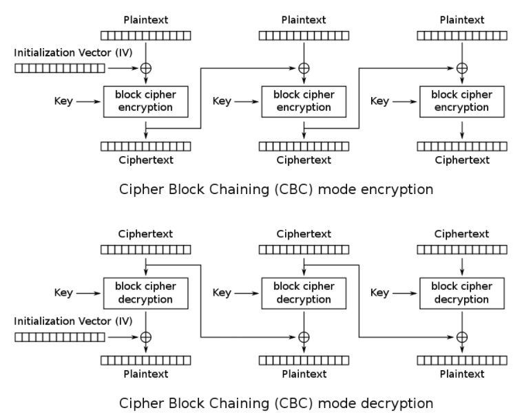
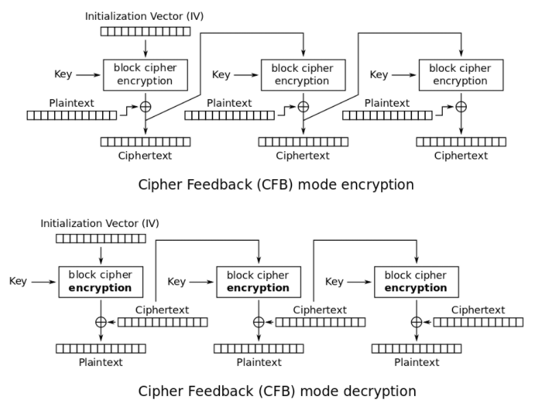

# Tema1-SI
## Descrierea aplicatiei
  Aceasta aplicatie are rolul de a simula o infrastructura de de comunicatie ce utilizeaza criptosistemul AES. Are o arhitectura de tipul client-server, serverul fiind numit "Key Manager" si are scopul de a comunica cu nodurile A si B, iar clientii sunt doua noduri (A si B) care vor avea rolul de a cripta un fisier text intr-un mod ales (CBC/CFB), respectiv de a decripta in celalalt mod si afisa pe ecran mesajul initial. 
  Diagrama aplicatiei:  
  
  

## Implementarea criptarii
  Pentru criptarea mesajelor au fost folositi algoritmii CBC si CFB. Acesti algoritmi au fost implementati dupa schemele de mai jos, impartind mesajele in blocuri de cate 16 octeti, aplicand operatia xor si criptarea cu cheia si vectorul de initializare corespunzatoare: 

 
 
## Cerințe preliminare
  Pentru a putea folosi aplicația trebuie să:
  - instalați interpretorul Python
  - executați următoarele comenzi în directorul proiectului:
    - pip3 install pycryptodome
    - easy_install http://www.voidspace.org.uk/python/pycrypto-2.6.1/pycrypto-2.6.1.win32-py2.7.exe
    
  Acum puteți lansa aplicația. Rulați în această ordine: **server.py, client_A.py, client_B.py.** Pentru a modifica textul ce se dorește a fi criptat și decriptat, editați fișierul **fisier.txt**.
 
## Librării folosite
  - socket: pentru comunicarea dintre clienți și server
  - random: pentru generarea de chei sau vectori de inițializare random
  - Crypto.Cipher: pentru a folosi algoritmii de criptare/decriptare puși la dispoziție de limbajul de programare Python

## Link-uri utile
  1. https://www.novixys.com/blog/using-aes-encryption-decryption-python-pycrypto/
  2. https://en.wikipedia.org/wiki/Block_cipher_mode_of_operation
