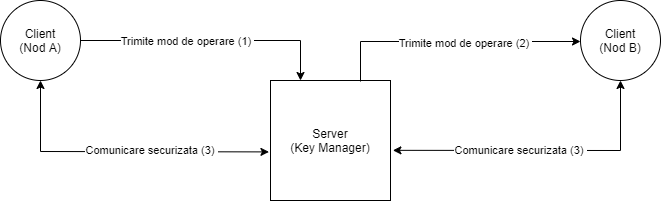

# Tema1-SI
## Descrierea aplicatiei
  Aceasta aplicatie are rolul de a simula o infrastructura de de comunicatie ce utilizeaza criptosistemul AES. Are o arhitectura de tipul client-server, serverul fiind numit "Key Manager" si are scopul de a comunica cu nodurile A si B, iar clientii sunt doua noduri (A si B) care vor avea rolul de a cripta un fisier text intr-un mod ales (CBC/CFB), respectiv de a decripta in celalalt mod si afisa pe ecran mesajul initial. 
  Diagrama aplicatiei:

